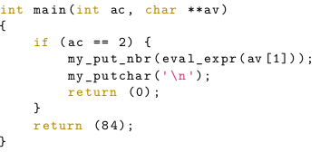

## EvalExpr
> Evaluate an arithmetic expression with priorities and parentheses
>
> Shunting yard algorithm, reverse polish notation...
>
> 4 days, 2 students, made with [Mathias Atchapa](https://www.linkedin.com/in/mathias-atchapa-12bb5b196/)

- [Description](#description)
- [Usage](#usage)
- [Example](#example)
- [Grade](#grade)

### Description

The eval_expr function had to be prototyped as follows :

`int eval_expr(char const *str);`

Given mandatory main :

The program expects that there is no syntax errors in the expression.

### Usage :

`./eval_expr EXPRESSION`

### Example

### Grade

The program crashed when a minus sign was put between two parentheses. It has been rectified in this repository. Our solution was to replace all minus sign by '-1*'.